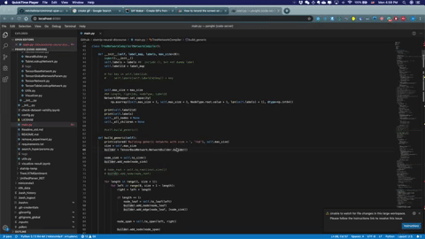

# Run VS code on remote server
Code server demo:\

## Installation
Run the following script it will create a `code-server` folder in your home directory and install it there

Copy paste this code to your terminal for installation: `wget https://gist.githubusercontent.com/Emrys-Hong/0aaccb17af5f896af1e9d00f8cf5b7f1/raw/59111f7ac80783f0d049334440a9d3f671d74031/code-server-setup.sh  -O - | bash`

Or you can copy from below

Installation is Done!

## Run the code server
On server:\
`code <folder>`

On local machine:\
`ssh -N -L 0.0.0.0:8080:localhost:8080 pengfei@192.168.32.32`
Congratulations, you can open vscode in your browser now.\
If you meet any error, probably somebody is already using that port, choose another port mapping.

## Vscode setup: Install pylint for code navigation:
1. Go to extension
2. Search extension `Python` and install. (reload if it requires)
3. It will prompt you to install pylint also, you can install it with `pip` or `conda`
4. Now you can pick function definition by `<command> + <click function>`

## Final step:
Hide bookmarks in chrome to make screen look bigger: \
`<command> + <shift> + b`

## What else you can do
Drag file to vscode and it automatically upload to server.

References:
code server github:
https://dev.to/babak/how-to-run-vs-code-on-the-server-3c7h

code server tutorial:
https://github.com/cdr/code-server
