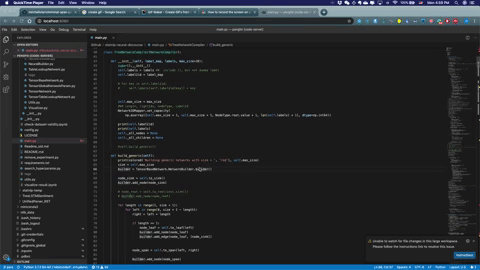

# Run VS code on remote server
Code server demo:



## Installation
Run the following script it will create a `code-server` folder in your home directory and install it there


Copy paste this code to your terminal for installation: 
```bash
wget https://gist.githubusercontent.com/Emrys-Hong/0aaccb17af5f896af1e9d00f8cf5b7f1/raw/59111f7ac80783f0d049334440a9d3f671d74031/code-server-setup.sh  -O - | bash
```

Or you can copy from below into your terminal: \
https://gist.github.com/Emrys-Hong/0aaccb17af5f896af1e9d00f8cf5b7f1

Installation is Done!


## Run the code server
On server:\
`code <folder>`

On local machine:\
`ssh -N -L 0.0.0.0:8080:localhost:8080 pengfei@192.168.32.32`

Congratulations, you can open vscode in your browser now.\

The default port number is 8080, If you meet any error, probably somebody is already using that port, choose another port mapping by `--port=1234`.


## Vscode setup: Install pylint for code navigation:
1. Go to extension
2. Search extension `Python` and install. (reload if it requires)
3. It will prompt you to install pylint also, you can install it with `pip` or `conda`
4. Now you can pick function definition by `<command> + <click function>`

## Makes it look better!:
1. Hide bookmarks in chrome to make screen look bigger: \
`<command> + <shift> + b`
2. This step is only for how to enable mac shortcut `<command+w>` to close the window in your browser. Step 1, you need to first disable the `Close Tab` option in your browser. Settings > Keyboard > shortcuts >  App Shortcus and add a shortcut by choosing Application to be your second favourite browser(if you do it in your best browser, you will not use that shortcut in that browser), Menu Title: `Close Tab`, Keyboard shortcut: `Control + q`. Step 2 in you vscode Keyboard Shortcuts: set `workbench.action.closeGroup` and `workbench.action.closeActiveEditor` and `close Window` to `<Command + w>`.

## What else you can do
Drag file to vscode and it automatically upload to server.

## References:
code server github:
https://dev.to/babak/how-to-run-vs-code-on-the-server-3c7h

code server tutorial:
https://github.com/cdr/code-server
